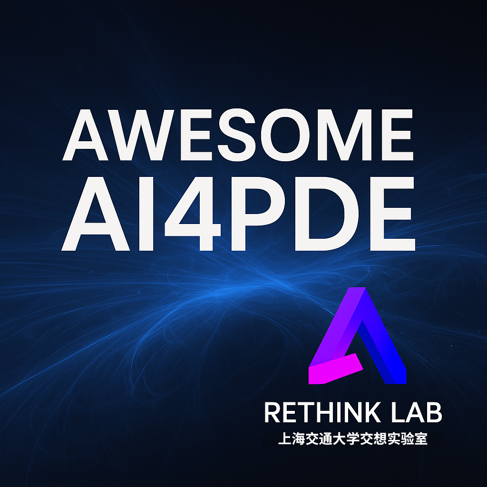

# Awesome AI4PDE

<!--  -->

> 📚 A curated list of papers and resources on applying Artificial Intelligence to Partial Differential Equations (AI4PDE).

## 📄 Papers

| Title | Authors | Year | Link |
|-------|---------|------|------|
| Physics-Informed Neural Networks (Example) | M. Raissi, P. Perdikaris, G. E. Karniadakis | 2019 | [Paper](https://arxiv.org/abs/1711.10561) |
| Neural Operator: Learning Operators with Deep Neural Networks (Example) | Zongyi Li, Nikola Kovachki, Burigede Liu, Anima Anandkumar | 2020 | [Paper](https://arxiv.org/abs/2005.03141) |

## 🔧 How to Contribute

Please refer to [CONTRIBUTING.md](CONTRIBUTING.md) for guidelines on how to add new papers.

## 📜 License

This project is licensed under the MIT License.